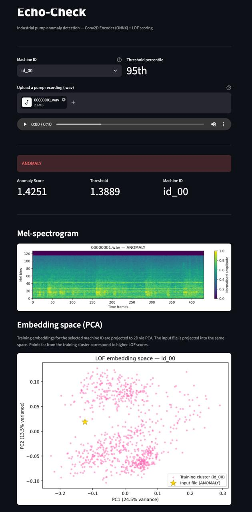
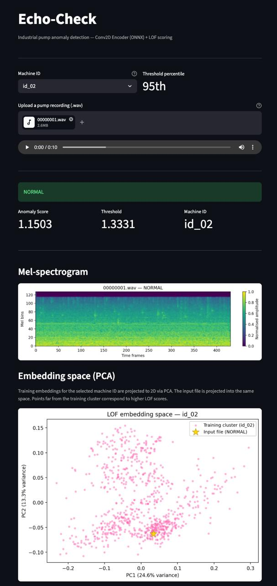
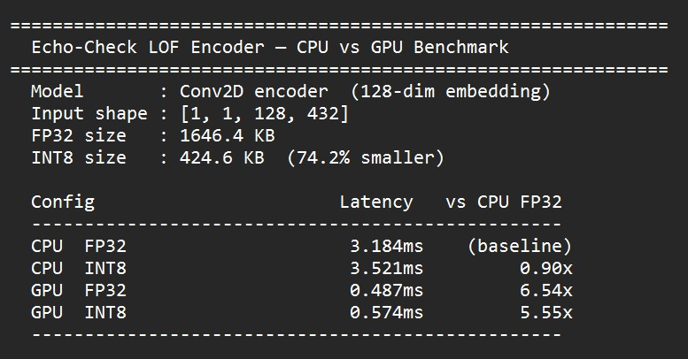
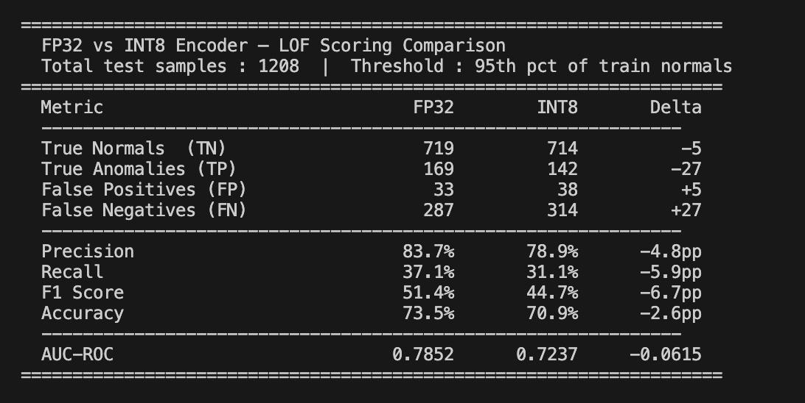

# Echo-Check

Modular, ONNX-optimized pipeline for industrial machinery anomaly detection using spectral audio analysis.

## Project Overview

Echo-Check is a system designed to detect anomalies in industrial machinery by analyzing acoustic emissions. It utilizes Mel-spectrogram conversion and unsupervised learning techniques to provide a robust framework for equipment health monitoring. The pipeline is optimized for edge deployment using ONNX.

## Project Structure

| Directory/File                 | Description                                                   |
| :----------------------------- | :------------------------------------------------------------ |
| `data/`                        | Raw and processed audio files (excluded from version control) |
| `docs/`                        | Project documentation and architecture diagrams               |
| `models/`                      | Trained weights and exported .onnx files                      |
| `notebooks/`                   | Jupyter notebooks for EDA and experiments                     |
| `src/`                         | Core source code for data processing and inference            |
| `src/ingestion.py`             | Mel-spectrogram extraction using the `Wav_to_mel` class       |
| `src/preprocess_all.py`        | Batch processing automation for dataset preparation           |
| `src/create_train_test.py`     | Train/Test split creation                                     |
| `src/conv2d_model.py`          | Conv2D Autoencoder architecture definition                    |
| `src/training.py`              | Conv2D Autoencoder training                                   |
| `src/evaluate_conv2d_lof.py`   | LOF scoring on encoder embeddings                             |
| `src/phase3_optimize.py`       | ONNX export, graph optimisation, INT8 quantization            |
| `src/inference.py`             | ONNX runtime wrapper for anomaly detection                    |
| `app.py`                       | Streamlit frontend for end-to-end inference                   |
| `tests/`                       | Unit tests for processing modules                             |
| `tests/test_processed_data.py` | Data integrity and normalization verification                 |
| `tests/splits_test.py`         | Train/Test split verification                                 |
| `tests/test_classification.py` | Per-file classification report                                |
| `tests/test_conv2d_model.py`   | Architecture unit tests                                       |
| `tests/test_training.py`       | Training pipeline unit tests                                  |
| `tests/test_lof.py`            | LOF scoring unit tests                                        |
| `requirements.txt`             | Python package dependencies                                   |
| `environment.yml`              | Conda environment specification                               |

## Getting Started

### Prerequisites

- Python 3.9
- Conda (recommended for environment management)

### Installation

1. Clone the repository:
   ```bash
   git clone https://github.com/kolukawhale/Echo-Check.git
   cd Echo-Check
   ```
2. Create and activate the Conda environment:
   ```bash
   conda env create -f environment.yml
   conda activate echo-check
   ```
3. Alternatively, install dependencies via pip:
   ```bash
   pip install -r requirements.txt
   ```

## Data Procurement

Echo-Check utilizes the MIMII Dataset. Follow these steps to set up the data pipeline:

1. **Download**: Obtain the -6 dB files from the [MIMII Zenodo Page](https://zenodo.org/record/3384388). It is recommended to start with the pump dataset.
2. **Integrity Check**: Verify the integrity of the downloaded `.zip` files via MD5 hash comparison before proceeding.
3. **Organization**: Unzip the files into `data/raw/pump/` maintaining the following structure:
   ```text
   data/raw/pump/
   └── id_00/
       ├── normal/
       └── abnormal/
   ```

## Usage

### 1. Data Preprocessing

Convert raw `.wav` audio into normalized 3D NumPy arrays (Mel-spectrograms). This script processes all machine ID folders and saves optimized `.npy` files to `data/processed/`.

```bash
python src/preprocess_all.py
```

### 2. Verify Data Integrity

Ensure all processed data cubes meet the required specifications (Shape: [Batch, 128, 431], Range: [0, 1]).

```bash
python tests/test_processed_data.py
```

### 3. Create Train/Test Split

Generate train and test sets from the processed data. This script splits normal data 80/20 and combines all abnormal data into the test set with ground truth labels.

```bash
python src/create_train_test.py
```

### 4. Verify Splits

Verify the integrity of the train/test splits, ensuring no data leakage and correct shapes.

```bash
python tests/splits_test.py
```

### 5. Train the Autoencoder

Trains the Conv2D Autoencoder on normal spectrograms only using MSE loss. Saves `autoencoder.pth` and `encoder.pth` to `models/conv2d/`.

```bash
python src/training.py
```

### 6. LOF Evaluation

Extracts encoder embeddings from normal training data, fits a Local Outlier Factor model, and evaluates anomaly detection performance across all machine IDs.

```bash
python src/evaluate_conv2d_lof.py
```

### 7. ONNX Export & INT8 Quantization

Exports the trained encoder to ONNX, applies graph optimisation, and quantizes to INT8 for edge deployment. Validates AUC retention and benchmarks CPU latency.

```bash
python src/phase3_optimize.py
```

Outputs saved to `models/phase3_outputs_lof/`:

- `encoder_full.onnx` — full FP32 encoder
- `encoder_simplified.onnx` — graph-optimised FP32
- `encoder_int8.onnx` — INT8 quantized deployment model

### 8. Run the Streamlit App

Launches the frontend — upload a `.wav` file, select the machine ID, and get a NORMAL/ANOMALY prediction with the Mel-spectrogram visualised.

```bash
streamlit run app.py
```

### 9. Full Classification Report

Reports correct vs incorrect classifications per machine ID with confusion matrix.

```bash
python tests/test_classification.py
```

## UI Guide

The Echo-Check Streamlit app provides a browser-based interface for running anomaly detection on a single `.wav` recording without touching the command line. Launch it with:

```bash
streamlit run app.py
```

---

### Step 1 — Select a Machine ID and upload a recording

At the top of the app, use the **Machine ID** dropdown to select the pump you are inspecting (`id_00`, `id_02`, `id_04`, or `id_06`). This is important — it tells the app which machine's normal training data to use when calibrating the anomaly threshold. Selecting the wrong ID will produce unreliable predictions.

The **Threshold percentile** shown next to the dropdown is fixed at the **95th percentile**, meaning a recording must score higher than 95% of normal training recordings before it is flagged as an anomaly.

Then use the **Upload a pump recording (.wav)** file picker to select a `.wav` file from your machine. A 10-second clip from the MIMII dataset works best. Once uploaded, an audio player appears so you can listen to the recording before inference runs.

---

### Step 2 — Read the result

Inference runs automatically after upload. The result banner turns **red for ANOMALY** or **green for NORMAL**. Below the banner, three metrics are shown side by side:

| Metric            | What it means                                                                                                                                            |
| :---------------- | :------------------------------------------------------------------------------------------------------------------------------------------------------- |
| **Anomaly Score** | The LOF score for this recording. Higher = further from normal behaviour.                                                                                |
| **Threshold**     | The 95th-percentile LOF score computed from this machine's normal training data. The recording is flagged as an anomaly if its score exceeds this value. |
| **Machine ID**    | Confirms which machine's threshold was used for this prediction.                                                                                         |

The two screenshots below show both possible outcomes for the same file (`00000001.wav`) tested against different machine IDs.

**ANOMALY** — tested against `id_00`. Score (1.4251) exceeds the threshold (1.3889):



**NORMAL** — same file tested against `id_02`. Score (1.1503) is below `id_02`'s threshold (1.3331):



This illustrates why selecting the correct Machine ID matters — the threshold is machine-specific.

---

### Step 3 — Inspect the Mel-spectrogram

Below the result metrics, the app renders the **Mel-spectrogram** of the uploaded file. This is a heatmap of frequency energy over time: the x-axis is time (in frames), the y-axis is frequency (Mel bins 0–128), and colour indicates normalised amplitude — brighter/yellower = higher energy.

A normal pump recording typically shows a smooth, consistent frequency band. An anomalous recording often shows disrupted patterns, extra high-frequency energy, or irregular bursts that stand out visually.

---

### Step 4 — Inspect the Embedding Space (PCA)

The final section shows a **2D PCA projection** of the encoder's internal representation. Every pink dot is a training recording from the selected machine ID projected into the same space. The gold star (⭐) marks where the uploaded file lands in that space.

**How to read it:** if the star sits inside or near the pink cluster, the recording looks similar to normal training data and scores low (NORMAL). If the star is far from the cluster — as in the ANOMALY example above — the encoder has produced a significantly different representation for this recording, driving the LOF score above the threshold.

This plot is especially useful for borderline cases where the score is close to the threshold.

---

## Glossary of Experiments

### `CPU v/s GPU Benchmarks`



---

### `Comaprsion of ONNX + Quantized model to normal model performance`

## 

## License

This project is licensed under the MIT License.
